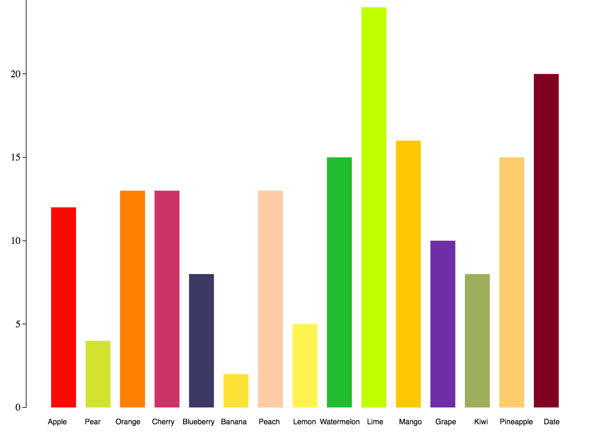
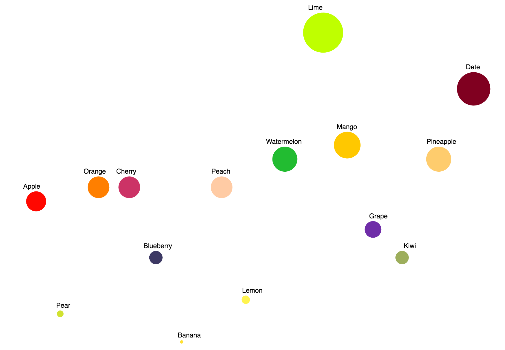
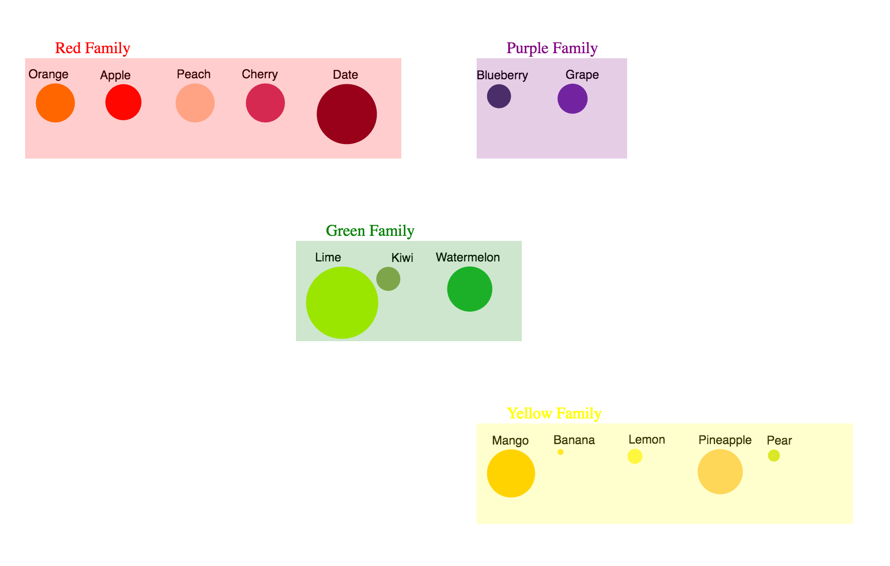

# Animated Transitions

Project link: ["Bar chart to Bubble chart to Pack chart"](http://nzholmes.github.io/03-Animation/index.html).

# Team

- Zheng Nie, nzholmes

# Description of three-stage transitions
 - The first stage is bar chart. I added transition to generate bars with height from zero to particular fruit count. 
 
 
 - The second stage is bubble chart. To smoothly transition from bar chart, I took advantage of "rx" and "ry" to reduce rectangles to ellipses and finally to circles when "rx"="ry", with radius three times the count.
 
 
 - The third stage is packs chart, i.e cluster fruit with similar colors into four color families. I created four cluster arrays and four cluster center arrays, respectively containing cluster elements and cluster centers. Then I moved fruit to four rectangles that represents corresponding color cluster.
 

# Technical Achievements

Technically speaking, the key of this assignment lies in how and how long one state transitions into another state. So in this assignment, I learned the usage of d3 animation, which mainly consists of three parts: transition, delay and duration. 

To transform bar chart into bubble chart, I remove y axis and made use of the attribute "rx" and "ry" of ellipse to make the transformation look smooth.  

In grouping bubbles into different color categories,  I set four clusters and their centers at first, then bundled the "rect" element and "text" element into a "g" element and finally moved them to their specific cluster centers. 

The challenge here is to form cluster circles to contain specific "children" just as what the formal d3 pack layout has achieved. Instead, I drew four rectangles to represent corresponding color clusters with their fruit children inside them.

# Design Achievements

The biggest challenge of this assignment undoubtedly is to come up with reasonable transitions  without abrupt change so that audiences can clearly track and feel how data is processed. 

My design is composed of three stages: bar chart, bubble chart and packs chart. I added colors representative of those fruit in the dataset, though this made it a little hard to distinguish between them. But I still think this is necessary because the ultimate stage of this design is to cluster fruit into four color families: red family, green family, purple family and yellow family.
